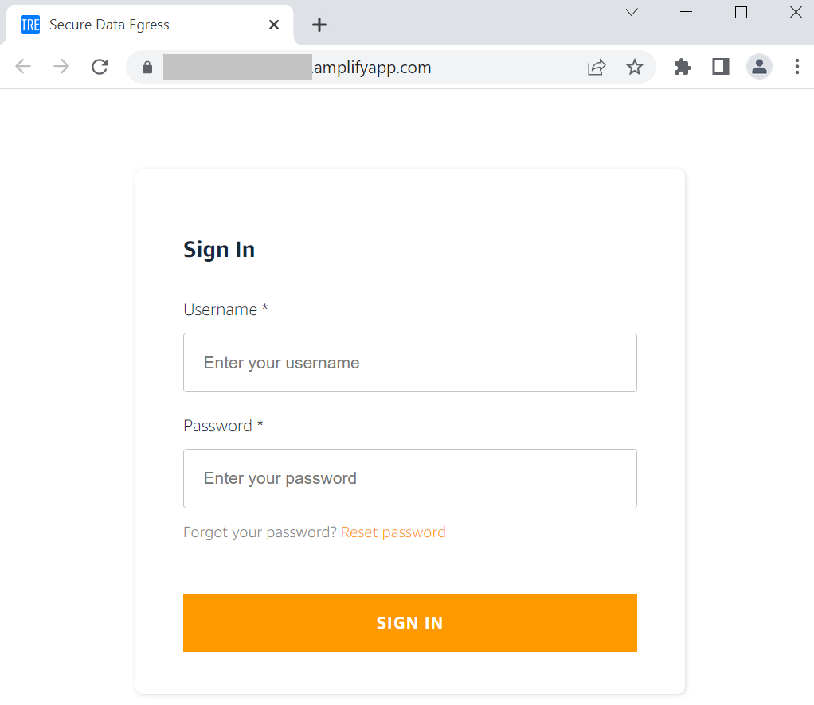

# Deployment Instructions

---

**Time to deploy**: Approximately 10 minutes

Log in to the [AWS Management Console](https://console.aws.amazon.com/) using Admin privileges.

The EC2 instance would already be created as part of previous
steps for installing the TRE setup and the source code already downloaded.

## Log in to the EC2 instance

- [ ] Follow these [instructions](https://docs.aws.amazon.com/AWSEC2/latest/UserGuide/session-manager.html)
  to learn how to connect via SSM to the EC2 instance created for deployment.
- [ ] Download the source code repo using below command and change directory

```console
git clone https://github.com/HicResearch/treehoose-egress-app-frontend.git
cd treehoose-egress-app-frontend
```

- [ ] Edit file *.env.local* in the `./treehoose-egress-app-frontend/` directory. Change the following required
 parameters for the web application:

|Parameter Name|Description|Location|
|:-----------------|:-----------|:-------------|
|REACT_APP_APPSYNC_API|Provide resource created in Step 4B - Egress API URL (e.g. "<https://.../graphql>) |Check [AWS CloudFormation](https://eu-west-2.console.aws.amazon.com/cloudformation/home?region=eu-west-2#/) *Outputs* tab for *Stack* "EgressAppBackend" and locate *AppSyncGraphQLURL* or go to [AWS AppSync APIs](https://eu-west-2.console.aws.amazon.com/appsync/home?region=eu-west-2#/apis) -> Select the API created -> *Settings* -> *API URL* |
|REACT_APP_USER_POOL_CLIENT_ID|Provide resource created in Step 4B - App Client Id |Check [AWS CloudFormation](https://eu-west-2.console.aws.amazon.com/cloudformation/home?region=eu-west-2#/) *Outputs* tab for *Stack* "EgressAppBackend" and locate *CognitoAppClientId* or go to [Amazon Cognito Pools](https://eu-west-2.console.aws.amazon.com/cognito/users/?region=eu-west-2#) -> Select the User Pool created -> Under *General settings* -> *App clients* -> *App client id* |
|REACT_APP_USER_POOL_ID|Provide resource created in Step 4B - User Pool Id |Check [AWS CloudFormation](https://eu-west-2.console.aws.amazon.com/cloudformation/home?region=eu-west-2#/) *Outputs* tab for *Stack* "EgressAppBackend" and locate *CognitoUserPoolId* or go to [Amazon Cognito Pools](https://eu-west-2.console.aws.amazon.com/cognito/users/?region=eu-west-2#) -> *General settings* -> *Pool Id* |
|REACT_APP_USER_POOL_DOMAIN|Provide resource created in Step 4B - User Pool Domain Name (e.g. {cognito_userpool_domain}.auth.eu-west-2.amazoncognito.com) |Check [AWS CloudFormation](https://eu-west-2.console.aws.amazon.com/cloudformation/home?region=eu-west-2#/) *Outputs* tab for *Stack* "EgressAppBackend" and locate *CognitoUserPoolDomain* or go to [Amazon Cognito Pools](https://eu-west-2.console.aws.amazon.com/cognito/users/?region=eu-west-2#) -> Under *App integration* -> *Domain name* |
|REACT_APP_REGION|Provide current AWS Region (i.e. eu-west-2)|NA|
|REACT_APP_EGRESS_IG_ROLE|Provide same value as in cdk.json file edited in Step 4B for parameter *egress_reviewer_roles* - value 1|Check [AWS CloudFormation](https://eu-west-2.console.aws.amazon.com/cloudformation/home?region=eu-west-2#/) *Outputs* tab for *Stack* "EgressAppBackend" and locate *EgressReviewerRole1*|
|REACT_APP_EGRESS_RIT_ROLE|Provide same value as in cdk.json file edited in Step 4B for parameter *egress_reviewer_roles* - value 2 - This can be removed if using single approval|Check [AWS CloudFormation](https://eu-west-2.console.aws.amazon.com/cloudformation/home?region=eu-west-2#/) *Outputs* tab for *Stack* "EgressAppBackend" and locate *EgressReviewerRole2*|
|REACT_APP_MAX_DOWNLOADS_ALLOWED|Provide same value as in cdk.json file edited in Step 4B for parameter *max_downloads_allowed* |Check [AWS CloudFormation](https://eu-west-2.console.aws.amazon.com/cloudformation/home?region=eu-west-2#/) *Outputs* tab for *Stack* "EgressAppBackend" and locate *MaxDownloadsAllowed*|
|REACT_APP_FEDERATED_LOGIN_ENABLED|Flag to control enabling and disabling of federated login||
|REACT_APP_REDIRECT_SIGNIN_URL|Provide the URL where you want the user to redirect after sign-in. Usually the URL on which you access the Single Page WebApp ||
|REACT_APP_REDIRECT_SIGNOUT_URL|Provide the URL where you want the user to redirect after sign-out. Usually the URL on which you access the Single Page WebApp||
|REACT_APP_FEDERATED_LOGIN_BUTTON_VALUE|Value you want to display for the button to initiate federated login||
|REACT_APP_FEDERATED_IDENTITY_PROVIDER_NAME|Name for the Federated Identity provider as setup in Cognito||

- [ ] Run the following commands to build the React frontend code:

```bash
cd /home/ec2-user/tmp/tre/treehoose-egress-app-frontend
nvm install v16.15.0
nvm use v16.15.0
npm install
npm run build
```

- [ ] Run the following commands to build the React app:

```bash
cd /home/ec2-user/tmp/tre/treehoose-egress-app-frontend/build
zip -FSr ../build.zip ./
```

- [ ] Run the following commands to copy the React app to S3 and trigger an automatic
 deployment to Amplify:

```bash
cd /home/ec2-user/tmp/tre/treehoose-egress-app-frontend
aws s3 cp build.zip s3://{egress web app bucket created in Step 4B}
```

To find the egress web app bucket name, you can check
the [AWS CloudFormation](https://eu-west-2.console.aws.amazon.com/cloudformation/home?region=eu-west-2#/)
*Outputs* tab for *Stack* "EgressAppBackend" and locate *EgressWebAppS3BucketName*

Verify the Amplify app has been updated automatically and the website is reachable:

- [ ] Go to Service: [AWS Amplify](https://eu-west-2.console.aws.amazon.com/amplify/home?region=eu-west-2#/)
- [ ] Select the app and branch created in Step 4B
- [ ] Confirm the status in the app branch is: *Deployment successfully completed.*
- [ ] Open the URL from *Domain* and confirm a login prompt appears like in the image below


